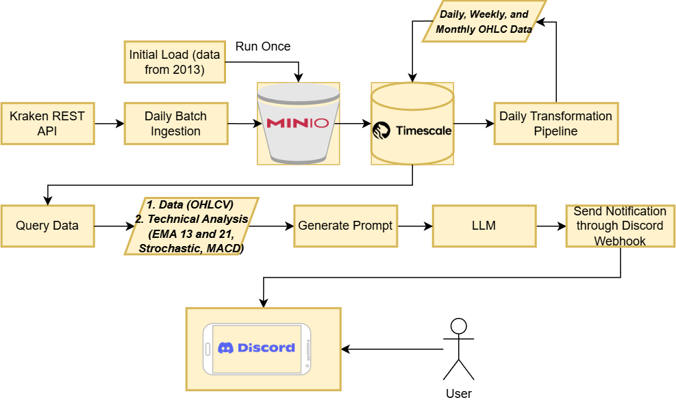

# LLM Technical Analyst Assistant

## Project Description
This application is powered by a **Multimodal Large Language Model (LLM)** to perform **technical analysis on cryptocurrencies**. I was inspired to build this proof-of-concept for two main reasons:

1. **Scalability** – It helps traders filter and identify cryptocurrencies that align with their trading strategy without manually analyzing thousands of charts.
2. **Explainability** – Unlike traditional algorithmic technical analysis, Multimodal LLMs can reason behind the technical analysis in natural language.

> **Disclaimer**: The analysis generated by the LLM should not be blindly trusted. Always validate the results before making any trading decisions. This project is a **proof-of-concept (POC)** intended to demonstrate feasibility, not to be used for real trading.

---

## Scope
| Component                | Description                                                                          |
|--------------------------|--------------------------------------------------------------------------------------|
| **Multimodal LLM**       | Claude Sonnet 4                                                                      |
| **Cryptocurrency**       | Bitcoin                                                                              |
| **Timeframes Analyzed**  | Daily, Weekly, and Monthly                                                           |
| **Technical Indicators** | Exponential Moving Average (EMA), Stochastic Oscillator, and Moving Average Convergence Divergence (MACD) |

---

## 🧰 Technologies Used
1. **MinIO** – Used as object storage to save backup data pulled from the Kraken REST API.
2. **TimescaleDB** – A time-series database to store and process historical cryptocurrency OHLC data.
3. **Docker** – Used for setting up and testing infrastructure locally (MinIO and TimescaleDB).
4. **Langchain** – Provides tooling to create applications powered by LLMs. It offers modularity and scalability for interacting with different LLMs.

---

## Project Architecture

---

## What I learned
- Built a complete end-to-end data pipeline, starting from fetching data via Kraken API, storing it in TimescaleDB, and processing it through **silver** and **gold** layers.
- Applied a **Multimodal LLM** to interpret technical charts and indicators to generate human-readable analysis.

---

## Future Improvements
1. Deploy the project to production.
2. Fine-tune the Multimodal LLM to enhance its understanding of technical patterns and analysis.
3. Expand the system with **autonomous AI agents**, each responsible for specific tasks:
   - Sentiment analysis
   - Global macroeconomic analysis
   - On-chain analytics  
   This will make the system capable of **multi-perspective crypto research**, beyond just technical analysis.

---
